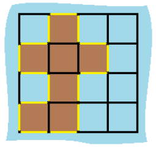
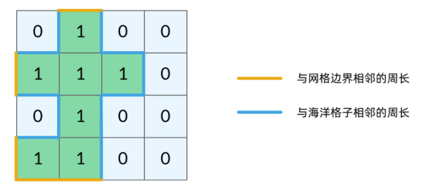

#### [463. 岛屿的周长](https://leetcode.cn/problems/island-perimeter/)

给定一个 row x col 的二维网格地图 grid ，其中：grid[i][j] = 1 表示陆地， grid[i][j] = 0 表示水域。

网格中的格子 水平和垂直 方向相连（对角线方向不相连）。整个网格被水完全包围，但其中恰好有一个岛屿（或者说，一个或多个表示陆地的格子相连组成的岛屿）。

岛屿中没有“湖”（“湖” 指水域在岛屿内部且不和岛屿周围的水相连）。格子是边长为 1 的正方形。网格为长方形，且宽度和高度均不超过 100 。计算这个岛屿的周长。

**示例 1：**



```python
输入：grid = [[0,1,0,0],[1,1,1,0],[0,1,0,0],[1,1,0,0]]
输出：16
解释：它的周长是上面图片中的 16 个黄色的边
```

示例 2：

```
输入：grid = [[1]]
输出：4
```

示例 3：

```
输入：grid = [[1,0]]
输出：4
```


提示：

- row == grid.length
- col == grid[i].length
- 1 <= row, col <= 100
- grid[i][j] 为 0 或 1

**思路与关键问题：**

周长如何计算？

这里周长可以从两个角度计算



实际上，周长就是边缘，当DFS函数因为 grid(r,c)超出网格范围 返回时，实际上就经过了一条黄色的边；当函数因为 当前格子是海洋格子返回的时候，实际上就经过了一条蓝色的边。这样周长的计算方法就出现了。

代码：

```python
class Solution:
    def islandPerimeter(self, grid: List[List[int]]) -> int:
        def backtracking(grid,r,c):
            if not inarea(grid,r,c):
                return 1
            if grid[r][c]==0:
                return 1
            if grid[r][c]>1:
                return 0
            grid[r][c]=2
            return backtracking(grid,r+1,c) + backtracking(grid,r-1,c) + backtracking(grid,r,c+1) + backtracking(grid,r,c-1)

        def inarea(grid,r,c):
            return 0<=r and r<len(grid) and 0<=c and c<len(grid[0])

        for x in range(len(grid)):
            for y in range(len(grid[0])):
                # for x,y in [(r+1,c),(r-1,c),(r,c-1),(r,c+1)]:
                if grid[x][y]==1:
                    return backtracking(grid,x,y)
        return 0
```

