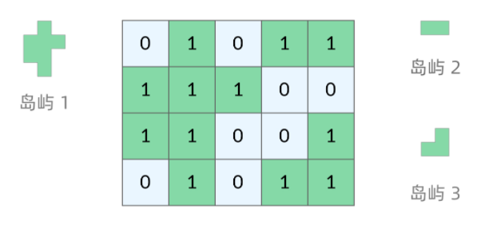
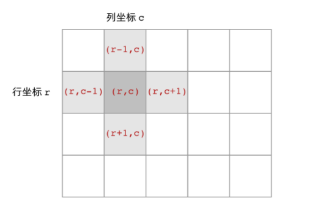
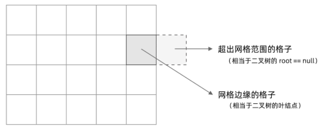

# 岛屿类问题的通用解法、DFS 遍历框架

### 网格类问题的 DFS 遍历方法

网格问题的基本概念
我们首先明确一下岛屿问题中的网格结构是如何定义的，以方便我们后面的讨论。

网格问题是由 m \times nm×n 个小方格组成一个网格，每个小方格与其上下左右四个方格认为是相邻的，要在这样的网格上进行某种搜索。

岛屿问题是一类典型的网格问题。每个格子中的数字可能是 0 或者 1。我们把数字为 0 的格子看成海洋格子，数字为 1 的格子看成陆地格子，这样相邻的陆地格子就连接成一个岛屿。



在这样一个设定下，就出现了各种岛屿问题的变种，包括岛屿的数量、面积、周长等。不过这些问题，基本都可以用 DFS 遍历来解决。

**DFS 的基本结构**
类比二叉树的深度优先搜索，实现网格问题的深度优先搜索

```python
def traverse(root):
    if not root:
        return
    traverse(root.left)
    traverse(root.right)
```

二叉树的两个要素：访问相邻结点和判断base case

相邻结点：二叉树是左子树和右子树，而网格搜索是左右上下邻居



判断base case：

二叉树的base case是root==null，这样一个条件判断其实有两个含义：一方面，这表示 root 指向的子树为空，不需要再往下遍历了。另一方面，在 root == null 的时候及时返回，可以让后面的 root.left 和 root.right 操作不会出现空指针异常。

网格的DFS，类似，遇到边界以外的，也为null，然后返回



网格DFS遍历的基本框架为：

```python
def grid(r,c):
    if not inarea(grid,r,c):
        return
    dfs(grid,r-1,c)
    dfs(grid,r+1,c)
    dfs(grid,r,c+1)
    dfs(grid,r,c-1)
    
def inarea(grid,r,c):#判断坐标(r,c)是否在网格中
    return 0<=r and r<len(grid) and 0<=c and c<len(grid[0])
    
```

### 避免重复遍历的方法

网络结构的DFS与二叉树的DFS的不同在于，遍历中可能遇到遍历过的结点，这时候，DFS 可能会不停地「兜圈子」，永远停不下来


避免重复的方法：标记已经遍历过的格子。以岛屿问题为例，我们需要在所有值为 1 的陆地格子上做 DFS 遍历。每走过一个陆地格子，就把格子的值改为 2，这样当我们遇到 2 的时候，就知道这是遍历过的格子了。

格子可能取3个值：

0：海洋格子

1：陆地格子（未遍历过）

2：陆地格子（已遍历过）

```python
def grid(r,c):
    if not inarea(grid,r,c):
        return
    if grid[r][c]!=1:#如果不是未遍历的岛屿，直接返回
    	return 
    grid[r][c]=2#标记已遍历岛屿，注意这个标记位置，其实就是每次遍历的终点
    dfs(grid,r-1,c)
    dfs(grid,r+1,c)
    dfs(grid,r,c+1)
    dfs(grid,r,c-1)
    
def inarea(grid,r,c):#判断坐标(r,c)是否在网格中
    return 0<=r and r<len(grid) and 0<=c and c<len(grid[0])
```

## 实例：

#### [200. 岛屿数量](https://leetcode.cn/problems/number-of-islands/)

```python
class Solution:
    def numIslands(self, grid: List[List[str]]) -> int:
        ans=0
        def Islands(grid,r,c):
            nonlocal ans
            if not inarea(grid,r,c):
                return
            if grid[r][c]!="1":
                return
            grid[r][c]="0"
            Islands(grid,r+1,c)
            Islands(grid,r-1,c)
            Islands(grid,r,c+1)
            Islands(grid,r,c-1)

        def inarea(grid,r,c):
            return 0<=r and r<len(grid) and 0<=c and c<len(grid[0])

        for i in range(len(grid)):#遍历一次，加一
            for j in range(len(grid[0])):
                if grid[i][j]=="1":
                    Islands(grid,i,j)
                    ans+=1

        return ans
```

