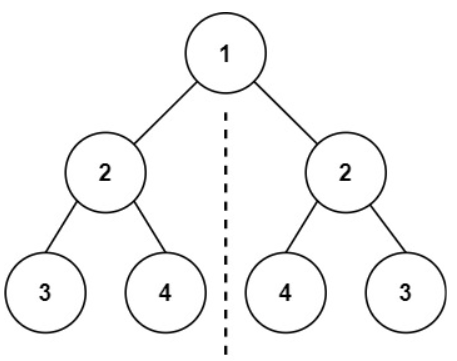

#### [101. 对称二叉树](https://leetcode.cn/problems/symmetric-tree/)

给你一个二叉树的根节点 root ， 检查它是否轴对称。

 

示例 1：

 

输入：root = [1,2,2,3,4,4,3]
输出：true
示例 2：


输入：root = [1,2,2,null,3,null,3]
输出：false


提示：

树中节点数目在范围 [1, 1000] 内
-100 <= Node.val <= 100


进阶：你可以运用递归和迭代两种方法解决这个问题吗？

**思路1：迭代法，以使用队列为例**

将树从左右第一个子节点拆开，判断这两个树是否互为对称

考虑两个方面，首先是节点数目不对应的情况

左右节点都为空

左节点为空，右节点不为空，右节点为空，左节点不为空

然后在节点数对应的前提下，考虑节点值

对比左右两个值。这里就用到队列思想，同时popleft()两个节点，对比这两个节点的值

在append的时候，也要注意顺序，把需要比较的两个节点放一起

```python
import collections
class Solution:
    def isSymmetric(self, root: TreeNode) -> bool:
        if not root:
            return True
        queue = collections.deque()
        queue.append(root.left) #将左子树头结点加入队列
        queue.append(root.right) #将右子树头结点加入队列
        while queue: #接下来就要判断这这两个树是否相互翻转
            leftNode = queue.popleft()
            rightNode = queue.popleft()
            if not leftNode and not rightNode: #左节点为空、右节点为空，此时说明是对称的
                continue
            
            #左右一个节点不为空，或者都不为空但数值不相同，返回false
            if not leftNode or not rightNode or leftNode.val != rightNode.val:
                return False
            queue.append(leftNode.left) #加入左节点左孩子
            queue.append(rightNode.right) #加入右节点右孩子
            queue.append(leftNode.right) #加入左节点右孩子
            queue.append(rightNode.left) #加入右节点左孩子
        return True
```

**思路2 ：递归法**

需要再写一个小函数，实现递归

递归方法中，True退出的设计放在左右节点都为空的情况下，符合递归的特点，直到下面都不再有节点，而前面又都不为False，返回True

此外因为里外都要相同，所以比较的时候，用and将里外内容连接

```Python
# Definition for a binary tree node.
# class TreeNode:
#     def __init__(self, val=0, left=None, right=None):
#         self.val = val
#         self.left = left
#         self.right = right
class Solution:
    def isSymmetric(self, root: Optional[TreeNode]) -> bool:
        if not root:
            return True
        return self.compare(root.left,root.right)

    def compare(self,right,left):
        if not left and not right:
            return True
        if not left or not right or left.val!=right.val:
            return False
        issame1=self.compare(right.right,left.left)
        issame2=self.compare(right.left,left.right)
        return issame1 and issame2
```

