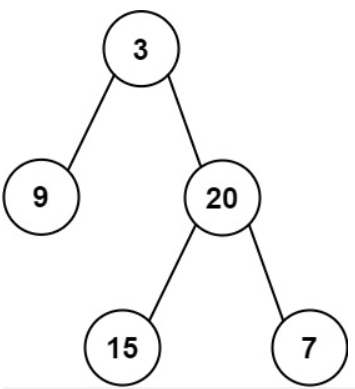
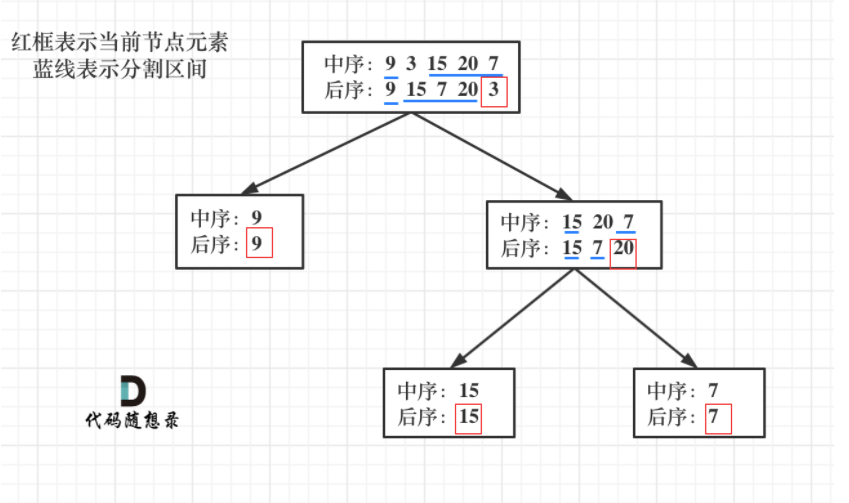

#### [106. 从中序与后序遍历序列构造二叉树](https://leetcode.cn/problems/construct-binary-tree-from-inorder-and-postorder-traversal/)

给定两个整数数组 inorder 和 postorder ，其中 inorder 是二叉树的中序遍历， postorder 是同一棵树的后序遍历，请你构造并返回这颗 二叉树 。

 

示例 1:



输入：inorder = [9,3,15,20,7], postorder = [9,15,7,20,3]
输出：[3,9,20,null,null,15,7]
示例 2:

输入：inorder = [-1], postorder = [-1]
输出：[-1]


提示:

1 <= inorder.length <= 3000
postorder.length == inorder.length
-3000 <= inorder[i], postorder[i] <= 3000
inorder 和 postorder 都由 不同 的值组成
postorder 中每一个值都在 inorder 中
inorder 保证是树的中序遍历
postorder 保证是树的后序遍历


**思路：通过对前序和中序的拆分，判断接下来左右节点的归属**

**构造二叉树时，必须有两种遍历相结合才能判断，而且这两种遍历必须是前序和中序 后序和中序 前序和后序不可以**

原因：

前序遍历：**中**->左-> 右

后序遍历：左->右->**中**

中序遍历：左->**中**->右

1.root节点在前序遍历的第一个，后序遍历的最后一个，然后找到root节点在中序遍历中的位置

2.中序遍历中root节点必然将左右子树划分开来，这也是中序遍历是必要的原因，前序和后序遍历中左右子树节点无法被划分。

3.根据中序节点划分的左右子树的节点长度，将前序/后序遍历中堆在一起的左右子树分开，新分开的左右子树中，子树的root节点依然位于新列表的最前/最后面。



```python
# Definition for a binary tree node.
# class TreeNode:
#     def __init__(self, val=0, left=None, right=None):
#         self.val = val
#         self.left = left
#         self.right = right
class Solution:
    def buildTree(self, inorder: List[int], postorder: List[int]) -> Optional[TreeNode]:
        if not postorder:
            return None
        val=postorder.pop()
        root=TreeNode(val)
        index_=inorder.index(val)
        left_i=inorder[:index_]
        right_i=inorder[index_+1:]
        left_p=postorder[:len(left_i)]#为什么不用index(用index也可以)
        right_p=postorder[len(left_i):(len(left_i)+len(right_i))]

        root.left=self.buildTree(left_i,left_p)
        root.right=self.buildTree(right_i,right_p)
        return root

```

