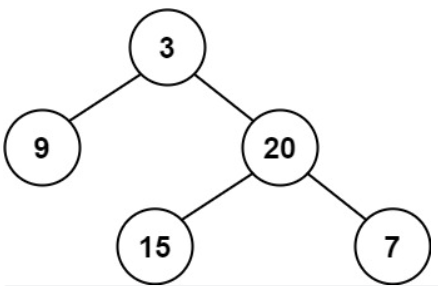

#### [110. 平衡二叉树](https://leetcode.cn/problems/balanced-binary-tree/)

给定一个二叉树，判断它是否是高度平衡的二叉树。

本题中，一棵高度平衡二叉树定义为：

> 一个二叉树*每个节点* 的左右两个子树的高度差的绝对值不超过 1 。

示例 1：



输入：root = [3,9,20,null,null,15,7]
输出：true
示例 2：


输入：root = [1,2,2,3,3,null,null,4,4]
输出：false
示例 3：

输入：root = []
输出：true


提示：

树中的节点数在范围 [0, 5000] 内
-10^4 <= Node.val <= 10^4

**思路：题目主要是要求二叉树各个节点的深度，因此最好用递归方法**，此外，因为要判断子树的高度差，所以应采用自底向上的方法，先判断子节点是否为平衡点，如果不是，直接跳过，降低运算复杂度

```python
# Definition for a binary tree node.
# class TreeNode:
#     def __init__(self, val=0, left=None, right=None):
#         self.val = val
#         self.left = left
#         self.right = right
class Solution:
    def isBalanced(self, root: Optional[TreeNode]) -> bool:
        def height(root):
            if not root:
                return 0
            hleft=height(root.left)
            hright=height(root.right)
            if hleft==-1 or hright==-1 or abs(hleft-hright)>1:
                return -1
            else:
                return max(hleft,hright)+1
        return height(root)>=0
```

