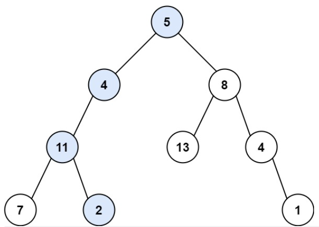
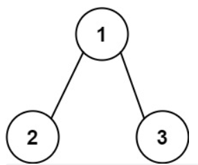

#### [112. 路径总和](https://leetcode.cn/problems/path-sum/)

给你二叉树的根节点 root 和一个表示目标和的整数 targetSum 。判断该树中是否存在 根节点到叶子节点 的路径，这条路径上所有节点值相加等于目标和 targetSum 。如果存在，返回 true ；否则，返回 false 。

叶子节点 是指没有子节点的节点。

 

示例 1：



输入：root = [5,4,8,11,null,13,4,7,2,null,null,null,1], targetSum = 22
输出：true
解释：等于目标和的根节点到叶节点路径如上图所示。

示例 2：



输入：root = [1,2,3], targetSum = 5
输出：false
解释：树中存在两条根节点到叶子节点的路径：
(1 --> 2): 和为 3
(1 --> 3): 和为 4
不存在 sum = 5 的根节点到叶子节点的路径。

示例 3：

输入：root = [], targetSum = 0
输出：false
解释：由于树是空的，所以不存在根节点到叶子节点的路径。


提示：

树中节点的数目在范围 [0, 5000] 内
-1000 <= Node.val <= 1000
-1000 <= targetSum <= 1000

**思路：重点依然在于遍历全部路径的方式 有递归和迭代两种方法，此外，要用if 条件句将左右节点分开，实现隐形回溯**

### 迭代法：

```python
# Definition for a binary tree node.
# class TreeNode:
#     def __init__(self, val=0, left=None, right=None):
#         self.val = val
#         self.left = left
#         self.right = right
class Solution:
    def hasPathSum(self, root: Optional[TreeNode], targetSum: int) -> bool:
        if not root:
            return False
        que_node=deque([root])
        que_val=deque([root.val])
        while que_node:
            node=que_node.popleft()
            val=que_val.popleft()
            if not node.left and not node.right:
                if val==targetSum:
                    return True
            if node.left:
                que_node.append(node.left)
                que_val.append(val+node.left.val)
            if node.right:
                que_node.append(node.right)
                que_val.append(val+node.right.val)
        return False
```

### 递归法：

```python
# Definition for a binary tree node.
# class TreeNode:
#     def __init__(self, val=0, left=None, right=None):
#         self.val = val
#         self.left = left
#         self.right = right
class Solution:
    def hasPathSum(self, root: Optional[TreeNode], targetSum: int) -> bool:
        res=0
        reslist=[]
        if not root :
            return False
        resu=self.deep(root,res,reslist)

        if targetSum in resu:
            return True
        return False
    
    def deep(self,root,res,result):
        res+=root.val
        if not root.left and not root.right:
            result.append(res)
        if root.left:
            leftnode=self.deep(root.left,res,result)
        if root.right:
            rightnode=self.deep(root.right,res,result)
        return result
```

