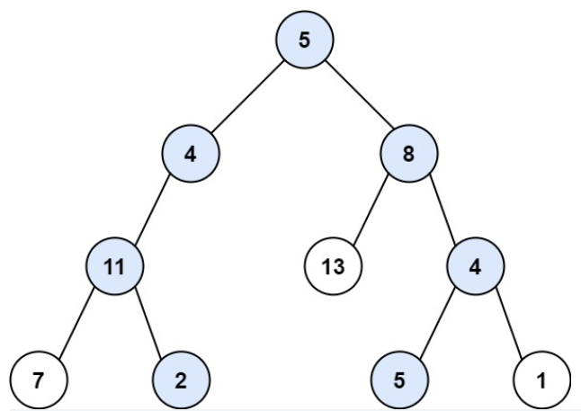
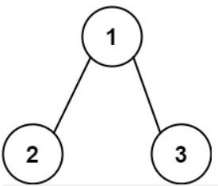

#### [113. 路径总和 II](https://leetcode.cn/problems/path-sum-ii/)

给你二叉树的根节点 root 和一个整数目标和 targetSum ，找出所有 从根节点到叶子节点 路径总和等于给定目标和的路径。

叶子节点 是指没有子节点的节点。 

示例 1：



输入：root = [5,4,8,11,null,13,4,7,2,null,null,5,1], targetSum = 22
输出：[[5,4,11,2],[5,8,4,5]]
示例 2：



输入：root = [1,2,3], targetSum = 5
输出：[]
示例 3：

输入：root = [1,2], targetSum = 0
输出：[]


提示：

树中节点总数在范围 [0, 5000] 内
-1000 <= Node.val <= 1000
-1000 <= targetSum <= 1000

**思路：考察对于递归路径的准确回溯，包括从哪里添加，哪里回溯，还有函数调用的问题**

```Python
# Definition for a binary tree node.
# class TreeNode:
#     def __init__(self, val=0, left=None, right=None):
#         self.val = val
#         self.left = left
#         self.right = right
class Solution:
    def pathSum(self, root: Optional[TreeNode], targetSum: int) -> List[List[int]]:

        def search(root,path,targetSum):#这里注意，最好不要再写一个self函数，作为一个子函数放在主函数下面就好，因为self函数必须有一个输出对应，而如果root为[1]这种情况，就没办法输出返回值。

            if not root.left and not root.right:
                if targetSum==0:
                    res.append(path[:])#这里需要用到一个浅拷贝，因为后面path会被pop掉
                return 
            
            if root.left:
                path.append(root.left.val)
                search(root.left,path,targetSum-root.left.val)
                path.pop()#这里是节点的终点，需要对path进行回溯
            if root.right:
                path.append(root.right.val)
                search(root.right,path,targetSum-root.right.val)
                path.pop()#这里是节点的终点，需要对path进行回溯

        res=[]
        if not root:
            return res
        path=[root.val]
        targetSum=targetSum-root.val
        search(root,path,targetSum)#如果不用返回值，不用赋值给函数，直接调用，把res放到search函数中计算一下就OK
        return res
```

