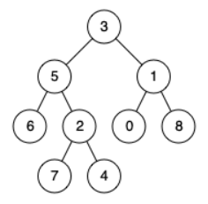
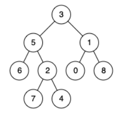
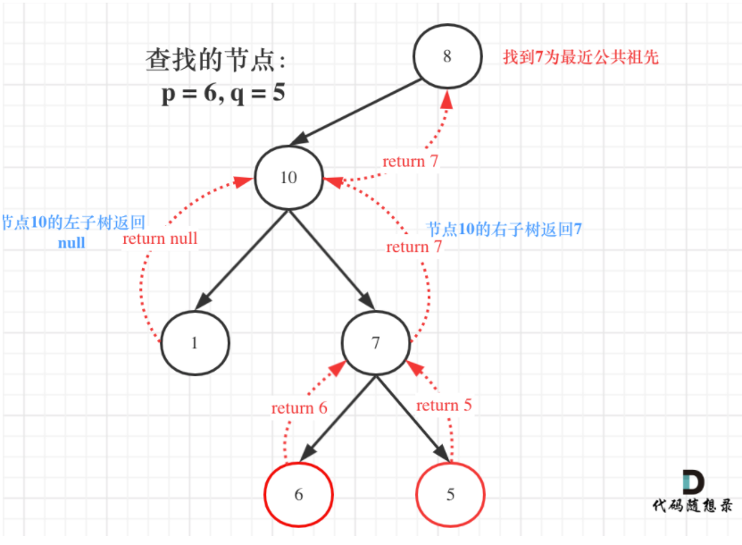

#### [236. 二叉树的最近公共祖先](https://leetcode.cn/problems/lowest-common-ancestor-of-a-binary-tree/)

首先，可以确定，要使用自底向上的方法查找公共祖先

二叉树回溯

如果找到一个节点，其左子树为节点p，右子树为节点q，那么该节点就是节点p与节点q的最近的公共祖先。

**但是很多人容易忽略一个情况，就是节点本身p(q)，它拥有一个子孙节点q(p)。**

使用后序遍历，回溯的过程，就是从低向上遍历节点，一旦发现满足第一种情况的节点，就是最近公共节点了。

如果遇到p或者q本身就是最近公共祖先的情况，，只需找到一个节点是p或者q时，直接返回当前节点，无需继续递归子树。如果接下来的遍历中，找到了后继节点满足第一种情况则修改返回值为后继节点，否则，继续返回已找到的节点即可。

递归3步

1.确定递归函数返回值及参数

如果只需要判断是否找到节点p或者q，返回值设定为布尔类型就Ok,但是因为还要返回最近公共节点，因此，如果遇到p或者q，就把该值返回，如果范围值为空，说明没找到p或者q

2.终止条件

找到p或者q或者遇到空节点，返回

**3.单层逻辑（重要）**

搜索一条边：有返回值

```
if (递归函数(root->left)) return ;

if (递归函数(root->right)) return ;
```

搜索整个树：不需要返回值

```
left = 递归函数(root->left);
right = 递归函数(root->right);
left与right的逻辑处理;
```

函数有返回值的情况下：如果要搜索一条边，递归函数返回值不为空的时候，立即返回

搜索整个树的情况下，使用left,right接住返回值，这个left，right后序还有逻辑处理的需要，就是后序遍历中，处理中间节点的逻辑（隐形回溯）

在代码的后序遍历中，如果想利用left和right做逻辑处理，不能立刻返回，需要等left与right 逻辑处理完之后才能返回。

## 题目

给定一个二叉树, 找到该树中两个指定节点的最近公共祖先。

百度百科中最近公共祖先的定义为：“对于有根树 T 的两个节点 p、q，最近公共祖先表示为一个节点 x，满足 x 是 p、q 的祖先且 x 的深度尽可能大（一个节点也可以是它自己的祖先）。”

 

示例 1：



```
输入：root = [3,5,1,6,2,0,8,null,null,7,4], p = 5, q = 1
输出：3
解释：节点 5 和节点 1 的最近公共祖先是节点 3 。
```

**示例 2：**



```
输入：root = [3,5,1,6,2,0,8,null,null,7,4], p = 5, q = 4
输出：5
解释：节点 5 和节点 4 的最近公共祖先是节点 5 。因为根据定义最近公共祖先节点可以为节点本身。
```

**示例 3：**

```
输入：root = [1,2], p = 1, q = 2
输出：1
```

提示：

树中节点数目在范围 [2, 10^5] 内。
-10^9 <= Node.val <= 10^9
所有 Node.val 互不相同 。
p != q
p 和 q 均存在于给定的二叉树中。

**思路：**

如果left和right 都不为空，说明此时root就是最近公共节点

如果left为空，right不为空，则返回right，说明目标节点是通过right返回的，并回溯传递到上一节点，

left 不为空，right为空，返回left，传递到上一个节点



如图，左子树返回null，右子树返回目标值7，那么此时节点10 的处理逻辑就是把右子树的返回值7返回上去。如果左右子树都为空返回right，left都可以，反正都是空

### 代码：

```python
# Definition for a binary tree node.
# class TreeNode:
#     def __init__(self, x):
#         self.val = x
#         self.left = None
#         self.right = None

class Solution:
    def lowestCommonAncestor(self, root: 'TreeNode', p: 'TreeNode', q: 'TreeNode') -> 'TreeNode':
        if not root or root==p or root==q:
            return root
        left=self.lowestCommonAncestor(root.left,p,q)
        right=self.lowestCommonAncestor(root.right,p,q)
		#这里放置处理left和right的关系
        if left and right:
            return root
        if left and not right:
            return left
        return right
```

