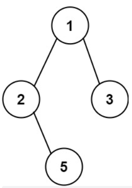

#### [257. 二叉树的所有路径](https://leetcode.cn/problems/binary-tree-paths/)

给你一个二叉树的根节点 root ，按 任意顺序 ，返回所有从根节点到叶子节点的路径。

叶子节点 是指没有子节点的节点。

示例 1：



输入：root = [1,2,3,null,5]
输出：["1->2->5","1->3"]
示例 2：

输入：root = [1]
输出：["1"]


提示：

树中节点的数目在范围 [1, 100] 内
-100 <= Node.val <= 100

**思路：先总结递归方法**

```python
# Definition for a binary tree node.
# class TreeNode:
#     def __init__(self, val=0, left=None, right=None):
#         self.val = val
#         self.left = left
#         self.right = right
class Solution:
    def binaryTreePaths(self, root: Optional[TreeNode]) -> List[str]:
        path_list=[]
        path=""
        if not root: return path_list
        return self.search(root,path,path_list)

    def search(self,root,path,result):
        path+=str(root.val)
        if not root.left and not root.right:
            result.append(path)
        if root.left:
            self.search(root.left,path+"->",result)#把"->"放这里，解决了开头不需要该符号的问题
        if root.right:   
            self.search(root.right,path+"->",result)
        return result

```

