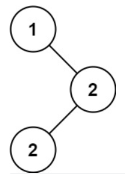

#### [501. 二叉搜索树中的众数](https://leetcode.cn/problems/find-mode-in-binary-search-tree/)

给你一个含重复值的二叉搜索树（BST）的根节点 root ，找出并返回 BST 中的所有 众数（即，出现频率最高的元素）。

如果树中有不止一个众数，可以按 任意顺序 返回。

假定 BST 满足如下定义：

结点左子树中所含节点的值 小于等于 当前节点的值
结点右子树中所含节点的值 大于等于 当前节点的值
左子树和右子树都是二叉搜索树

**示例 1：**



```
输入：root = [1,null,2,2]
输出：[2]
```

**示例 2：**

```
输入：root = [0]
输出：[0]
```

**提示：**

- 树中节点的数目在范围 `[1, 10^4]` 内
- `-10^5 <= Node.val <= 10^5`

**进阶：**你可以不使用额外的空间吗？（假设由递归产生的隐式调用栈的开销不被计算在内）


**思路：重点在于利用二叉搜索树的特点，计算众数，还有就是存在多个众数的情况如何处理**

```python
# Definition for a binary tree node.
# class TreeNode:
#     def __init__(self, val=0, left=None, right=None):
#         self.val = val
#         self.left = left
#         self.right = right
class Solution:
    def __init__(self):
        self.pre=TreeNode()#这里设定为空节点,为None
        self.count=0
        self.max_count=0
        self.result=[]

    def findMode(self, root: Optional[TreeNode]) -> List[int]:
        if not root:
            return 
        self.searching(root)
        return self.result

    def searching(self,cur):
        if not cur:
            return None

        self.searching(cur.left)
        if not self.pre:#识别第一个节点
            self.count=1
        if self.pre.val==cur.val:
            self.count+=1
        else:
            self.count=1

        self.pre= cur#替代

        if self.count==self.max_count:#这两步的设计很关键，节省了很大的时间复杂度，如果有多个最大值，就添加
            self.result.append(cur.val)

        if self.count>self.max_count:#如果大于，就覆盖
            self.max_count=self.count
            self.result=[cur.val]
        self.searching(cur.right)
```

