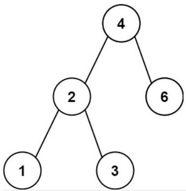
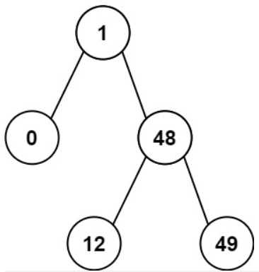

# [530. 二叉搜索树的最小绝对差](https://leetcode.cn/problems/minimum-absolute-difference-in-bst/)

给你一个二叉搜索树的根节点 `root` ，返回 **树中任意两不同节点值之间的最小差值** 。

差值是一个正数，其数值等于两值之差的绝对值。

 

**示例 1：**



```
输入：root = [4,2,6,1,3]
输出：1
```

**示例 2：**



```
输入：root = [1,0,48,null,null,12,49]
输出：1
```

**提示：**

- 树中节点的数目范围是 `[2, 10^4]`
- `0 <= Node.val <= 10^5`

**思路：依然使用中序遍历的方法，但是有很多细节需要注意，否则很容易出错**

```python
# Definition for a binary tree node.
# class TreeNode:
#     def __init__(self, val=0, left=None, right=None):
#         self.val = val
#         self.left = left
#         self.right = right
class Solution:
    def getMinimumDifference(self, root: Optional[TreeNode]) -> int:
        node=root#注意这里，最好将root与node分开，否则后面可能会乱
        stack,ans=[],inf
        pre=None#这里假设有个虚拟的前置节点
        while stack or node:
            if node:
                stack.append(node)
                node=node.left
            else:#左遍历已经到头了
                node=stack.pop()
                if pre:#通过这种方式，筛选掉第一个节点
                    ans=min(ans,node.val-pre.val)
                pre=node
                node=node.right
        return ans
```

