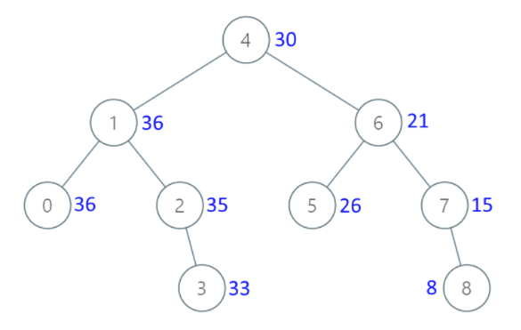

#### [538. 把二叉搜索树转换为累加树](https://leetcode.cn/problems/convert-bst-to-greater-tree/)

给出二叉 搜索 树的根节点，该树的节点值各不相同，请你将其转换为累加树（Greater Sum Tree），使每个节点 node 的新值等于原树中大于或等于 node.val 的值之和。

提醒一下，二叉搜索树满足下列约束条件：

节点的左子树仅包含键 小于 节点键的节点。
节点的右子树仅包含键 大于 节点键的节点。
左右子树也必须是二叉搜索树。
注意：本题和 1038: https://leetcode-cn.com/problems/binary-search-tree-to-greater-sum-tree/ 相同

 示例1：



```
输入：[4,1,6,0,2,5,7,null,null,null,3,null,null,null,8]
输出：[30,36,21,36,35,26,15,null,null,null,33,null,null,null,8]
```

示例 2：

```
输入：root = [0,null,1]
输出：[1,null,1]
```

示例 3：

```
输入：root = [1,0,2]
输出：[3,3,2]
```

示例 4：

```
输入：root = [3,2,4,1]
输出：[7,9,4,10]
```

**提示：**

- 树中的节点数介于 `0` 和 `10^4` 之间。

- 每个节点的值介于 `-10^4` 和 `10^4` 之间。

- 树中的所有值 **互不相同** 。

- 给定的树为二叉搜索树。

  **思路：核心是善用反过来的中序遍历，然后累加，这里累加的运用我不太熟，没有想到用题解的方式实现累加**，这里，声明local为局部变量的意思是，将local独立出去，仅仅在输出中序遍历.val的值的部分实现累加，否则，就会陷入right=backing(root.right)，就无法利用local实现想要的累加与赋值操作，注意此类用法的扩展使用

```python
# Definition for a binary tree node.
# class TreeNode:
#     def __init__(self, val=0, left=None, right=None):
#         self.val = val
#         self.left = left
#         self.right = right
class Solution:
    def convertBST(self, root: Optional[TreeNode]) -> Optional[TreeNode]:
        result=[]
        def backing(root):
            nonlocal total#声明为局部变量
            if not root:
                return 
            right=backing(root.right)
            total+=root.val#用相互替换的方式，实现累加与更新的分开
            root.val=total
            left=backing(root.left)
            return root
        total = 0
        return backing(root)
```

