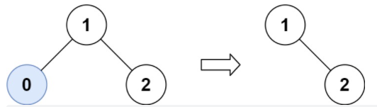
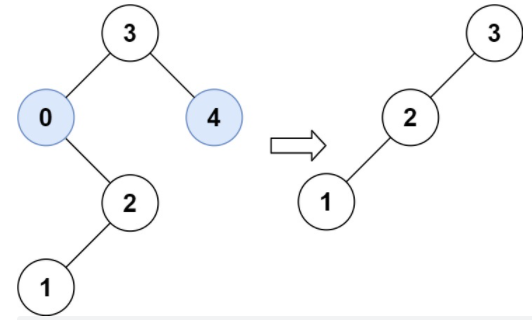

#### [669. 修剪二叉搜索树](https://leetcode.cn/problems/trim-a-binary-search-tree/)

给你二叉搜索树的根节点 root ，同时给定最小边界low 和最大边界 high。通过修剪二叉搜索树，使得所有节点的值在[low, high]中。修剪树 不应该 改变保留在树中的元素的相对结构 (即，如果没有被移除，原有的父代子代关系都应当保留)。 可以证明，存在 唯一的答案 。

所以结果应当返回修剪好的二叉搜索树的新的根节点。注意，根节点可能会根据给定的边界发生改变。

示例 1：



```
输入：root = [1,0,2], low = 1, high = 2
输出：[1,null,2]
```

**示例 2：**



```
输入：root = [3,0,4,null,2,null,null,1], low = 1, high = 3
输出：[3,2,null,1]
```

提示：

- 树中节点数在范围 [1, 10^4] 内

- 0 <= Node.val <= 10^4
- 树中每个节点的值都是 唯一 的
- 题目数据保证输入是一棵有效的二叉搜索树
- 0 <= low <= high <= 10^4


**思路：**

看到这个问题，很容易想当然地套用删除二叉搜索树中的节点的算法（450.删除二叉搜索树中的节点），但是实际上，忽略了很多细小而关键的问题：

这里删除的是一个区间以外的树，因s此，通常直接删除掉某个不符合的子树，而不再是一个值（仅针对二叉搜索树特性），为此，并不需要再重复删除单个子树中的接续操作。遇到不符的，直接返回一整个子树作为跳转就Ok，对于符合的节点，则正常遍历

```python
# Definition for a binary tree node.
# class TreeNode:
#     def __init__(self, val=0, left=None, right=None):
#         self.val = val
#         self.left = left
#         self.right = right
class Solution:
    def trimBST(self, root: Optional[TreeNode], low: int, high: int) -> Optional[TreeNode]:
        if not root :
            return None
        if root.val < low:
            return self.trimBST(root.right,low,high)#直接转向右子树
        if root.val > high:
            return self.trimBST(root.left,low,high)#直接转向左子树

        else:
            root.left=self.trimBST(root.left,low,high)#在符合范围要求的区间内正常遍历
            root.right=self.trimBST(root.right,low,high)
            return root

                        
```

