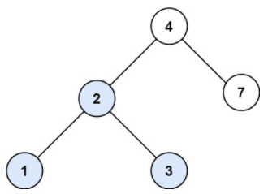
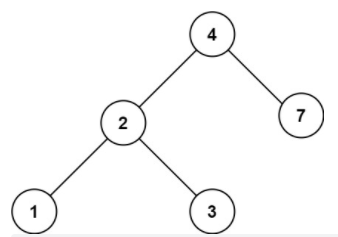

# [700. 二叉搜索树中的搜索](https://leetcode.cn/problems/search-in-a-binary-search-tree/)

这里主要熟悉二叉搜索树的概念

二叉搜索树是一个有序树：

如果它的左子树不空，则左子树上所有结点的值均小于它的根结点的值；

如果它的右子树不空，则右子树上所有结点的值均大于它的根节点的值；

它的左右子树也分别为二叉搜索树

这就决定了，二叉搜索树，递归遍历和迭代遍历和普通二叉树都不一样。


给定二叉搜索树（BST）的根节点 root 和一个整数值 val。

你需要在 BST 中找到节点值等于 val 的节点。 返回以该节点为根的子树。 如果节点不存在，则返回 null 。

 

示例 1:



输入：root = [4,2,7,1,3], val = 2
输出：[2,1,3]
示例 2:




输入：root = [4,2,7,1,3], val = 5
输出：[]


提示：

数中节点数在 [1, 5000] 范围内
1 <= Node.val <= 10^7
root 是二叉搜索树
1 <= val <= 10^7

```python
# Definition for a binary tree node.
# class TreeNode:
#     def __init__(self, val=0, left=None, right=None):
#         self.val = val
#         self.left = left
#         self.right = right
class Solution:
    def searchBST(self, root: Optional[TreeNode], val: int) -> Optional[TreeNode]:
        if not root:
            return 
        if root.val==val:
            return root
        if root.val<val:
            return self.searchBST(root.right,val)#这里需要再return 一下，不能直接调用函数，否则无法输出结果
        if root.val>val:
            return self.searchBST(root.left,val)
```

