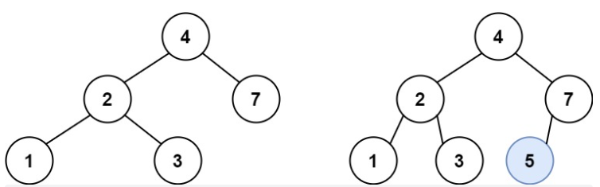
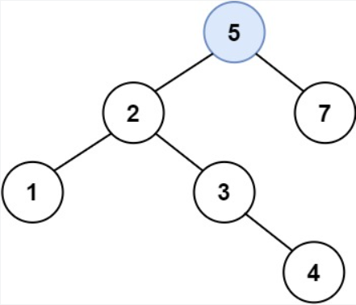

#### [701. 二叉搜索树中的插入操作](https://leetcode.cn/problems/insert-into-a-binary-search-tree/)

给定二叉搜索树（BST）的根节点 root 和要插入树中的值 value ，将值插入二叉搜索树。 返回插入后二叉搜索树的根节点。 输入数据 保证 ，新值和原始二叉搜索树中的任意节点值都不同。

注意，可能存在多种有效的插入方式，只要树在插入后仍保持为二叉搜索树即可。 你可以返回 任意有效的结果 。

 

示例 1：




```
输入：root = [4,2,7,1,3], val = 5
输出：[4,2,7,1,3,5]
解释：另一个满足题目要求可以通过的树是：
```



示例 2：

```
输入：root = [40,20,60,10,30,50,70], val = 25
输出：[40,20,60,10,30,50,70,null,null,25]
```

示例 3：

```
输入：root = [4,2,7,1,3,null,null,null,null,null,null], val = 5
输出：[4,2,7,1,3,5]
```


提示：

- 树中的节点数将在 [0, 10^4]的范围内。
- -10^8 <= Node.val <= 10^8
- 所有值 Node.val 是 独一无二 的。
- -10^8 <= val <= 10^8
- 保证 val 在原始BST中不存在。

**思路：**

关键有两点：

1.如何插入节点？ 当发现节点存在空缺值的时候插入

2.如何实现从小到大的遍历？如果当前节点值小于val(插入节点值)，往右遍历，如果当前节点值大于val，往左遍历。

3.如何保证不重复添加？通过节点值的大于小于去规范，二叉搜索树的特性

```python
# Definition for a binary tree node.
# class TreeNode:
#     def __init__(self, val=0, left=None, right=None):
#         self.val = val
#         self.left = left
#         self.right = right
class Solution:
    def insertIntoBST(self, root: Optional[TreeNode], val: int) -> Optional[TreeNode]:
        if not root:
            return TreeNode(val)
        if val>root.val:
            root.right=self.insertIntoBST(root.right,val)
        if val<root.val:
            root.left=self.insertIntoBST(root.left,val)
        return root
```

