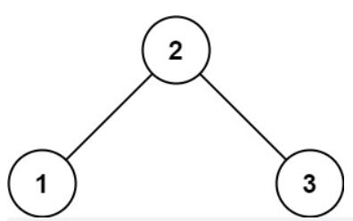
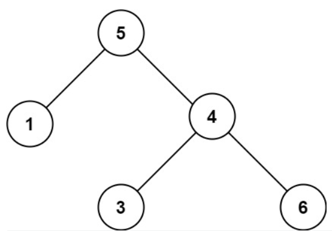

#### [98. 验证二叉搜索树](https://leetcode.cn/problems/validate-binary-search-tree/)

给你一个二叉树的根节点 root ，判断其是否是一个有效的二叉搜索树。

有效 二叉搜索树定义如下：

节点的左子树只包含 小于 当前节点的数。
节点的右子树只包含 大于 当前节点的数。
所有左子树和右子树自身必须也是二叉搜索树。


示例 1：



```python
输入：root = [2,1,3]
输出：true
```



```python
输入：root = [5,1,4,null,null,3,6]
输出：false
解释：根节点的值是 5 ，但是右子节点的值是 4 。
```

**提示：**

- 树中节点数目范围在`[1, 10^4]` 内
- `-2^31 <= Node.val <= 2^31 - 1`

**思路：中序遍历，实际上根据题意可以得到，这个二叉搜索树满足中序遍历由小到大的条件。可以按照中序遍历的顺序，后面节点必须大于前面的节点 **

```python
# Definition for a binary tree node.
# class TreeNode:
#     def __init__(self, val=0, left=None, right=None):
#         self.val = val
#         self.left = left
#         self.right = right
class Solution:
    def isValidBST(self, root: Optional[TreeNode]) -> bool:
        if not root :
            return False
        stack,inorder=[],-inf
        while stack or root:
            if root:
                stack.append(root)
                root=root.left
            else:
                root=stack.pop()
                if root.val <= inorder:
                    return False
                inorder=root.val
                root=root.right
        return True
```

中序遍历的迭代方法比较难记，因为顺序是左->中->右，所以需要先找到最深左叶子节点（在这一过程中用栈保存，用inorder保存最左的叶子结点，然后通过stack.pop()向上回退保存中间节点，再遍历右节点，按照这个思路进行。