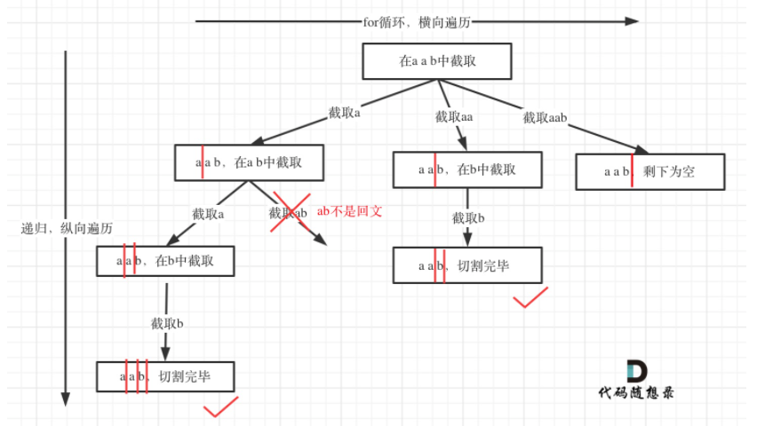

#### [131. 分割回文串](https://leetcode.cn/problems/palindrome-partitioning/)

给你一个字符串 s，请你将 s 分割成一些子串，使每个子串都是 回文串 。返回 s 所有可能的分割方案。

回文串 是正着读和反着读都一样的字符串。

 

示例 1：

输入：s = "aab"
输出：[["a","a","b"],["aa","b"]]
示例 2：

输入：s = "a"
输出：[["a"]]


提示：

1 <= s.length <= 16
s 仅由小写英文字母组成

**思路：**

**首先需要定如何切割字符串**

实际上是个for循环，初始位置是start_index+1，这样可以避免出现空字符，因为空字符也会识别成字符串，如果切割后的第一个是回文串，那么把后面的字符放进递归里，这里尤其注意，没有去改变 s，而是改变了指针，将指针start_index变成i+1,这种方法实际上很常用，最后，在处理不是回文串的情况，继续就行，因为ab不是回文串，但是aba是，可以继续向后查找。

总体思路就是，for循环切割，是回文串判断后面的内容，不是的话继续往后走，扩展字符串长度。



```python
class Solution:
    def partition(self, s: str) -> List[List[str]]:
        start_index=0
        path=[]
        res=[]
        def backtracking(s,start_index):
            if start_index>=len(s):
                res.append(path[:])
                return
            for i in range(start_index,len(s)):
                temp=s[start_index:i+1]#这里避免与开头第一个重复
                if temp==temp[::-1] :
                    path.append(temp)
                    backtracking(s,i+1)
                    path.pop()
                else:
                    continue

        backtracking(s,start_index)

        return res
```

