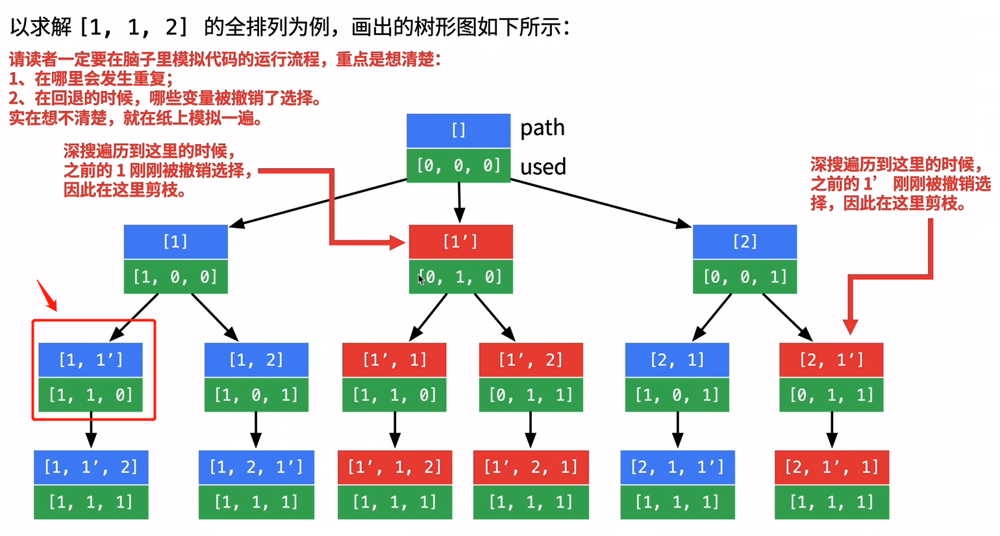

#### [47. 全排列 II](https://leetcode.cn/problems/permutations-ii/)

给定一个可包含重复数字的序列 nums ，按任意顺序 返回所有不重复的全排列。

 

示例 1：

```
输入：nums = [1,1,2]
输出：
[[1,1,2],
 [1,2,1],
 [2,1,1]]
```

示例 2：

```
输入：nums = [1,2,3]
输出：[[1,2,3],[1,3,2],[2,1,3],[2,3,1],[3,1,2],[3,2,1]]
```


提示：

1 <= nums.length <= 8
-10 <= nums[i] <= 10


思路：

and not used[i-1]这里的作用是从层上去去重，因为如果used[i-1]==0的话，说明，前面的节点刚刚回退出来，也就是，现在的节点与前面的节点同层，这里再加上这个条件nums[i]==nums[i-1]，说明，不但同层，而且这个节点的值与前一个节点的值相等，这就构成了continue的充要条件.

如果这里不加and not used[i-1]的话，就会造成，下图箭头所指的节点被跳过



```python
class Solution:
    def permuteUnique(self, nums: List[int]) -> List[List[int]]:
        res=[]
        path=[]
        if not nums:
            return []
        used = [0] * len(nums)
        nums.sort()
        def backtracking(nums,used):
            if len(path)==len(nums):
                res.append(path[:])
                return
            for i in range(0,len(nums)):
                if not used[i]:#这里用来规范，跳过之前遍历过的节点，到下一个新节点
                    if (i>0 and nums[i]==nums[i-1]) and not used[i-1]:
                        continue
                    path.append(nums[i])
                    used[i]=1
                    backtracking(nums,used)
                    path.pop()
                    used[i]=0
        backtracking(nums,used)        
        return res
```

