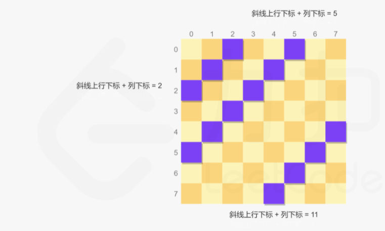

#### [51. N 皇后](https://leetcode.cn/problems/n-queens/)

按照国际象棋的规则，皇后可以攻击与之处在同一行或同一列或同一斜线上的棋子。

n 皇后问题 研究的是如何将 n 个皇后放置在 n×n 的棋盘上，并且使皇后彼此之间不能相互攻击。

给你一个整数 n ，返回所有不同的 n 皇后问题 的解决方案。

每一种解法包含一个不同的 n 皇后问题 的棋子放置方案，该方案中 'Q' 和 '.' 分别代表了皇后和空位。

示例 1：

```
输入：n = 4
输出：[[".Q..","...Q","Q...","..Q."],["..Q.","Q...","...Q",".Q.."]]
解释：如上图所示，4 皇后问题存在两个不同的解法。
```


示例 2：

```
输入：n = 1
输出：[["Q"]]
```


提示：

1 <= n <= 9

**思路：**

为判断一个位置所在的列已经两条斜对角是否已经有皇后，创建三个集合columns，dig1和dig2，分别记录每一列以及两个方向的每条斜线上是否有皇后。

而行通过回溯，一一遍历，也就不会存在重复。

重点在于，观察到两个对角线数值之间的关系：45度对角线上，横纵坐标的差总是相等，135度对角线上，横纵坐标的和总是相等，这样通过保存横纵坐标的差与和，就能实现去重。


 

每次放置皇后时，对于每个位置判断其是否在三个集合中，如果三个集合都不包含当前位置，则当前位置是可以放置皇后的位置。

```python
class Solution:
    def solveNQueens(self, n: int) -> List[List[str]]:
        row=["."]*n
        res=[]
        dig1=set()
        dig2=set()
        colums=set()
        queen=[-1]*n

        def genboard():
            nonlocal row
            board=[]
            for i in range(n):
                row[queen[i]] = "Q"
                board.append("".join(row))
                row[queen[i]]="."
            return board 
        
        def back_genqueeni(r):
            if r==n:
              board=genboard()
              res.append(board)

            else:
                for i in range(n):#如果开头就错了，那么n循环完了,r也加不到n，因此也不会有输出
                    if (r-i in dig1) or (r+i in dig2)or(i in colums):
                        continue
                    print(dig1,dig2)
                    queen[r]=i#这里储存每行的坐标
                    dig1.add(r-i)#行与列之差
                    dig2.add(r+i)#行与列之和
                    colums.add(i)

                    back_genqueeni(r+1)
                    #层层回退，直到开头，也就是第0行的第2 列
                    dig1.remove(r-i)
                    dig2.remove(r+i)
                    colums.remove(i)

        back_genqueeni(0)
        return res
```

