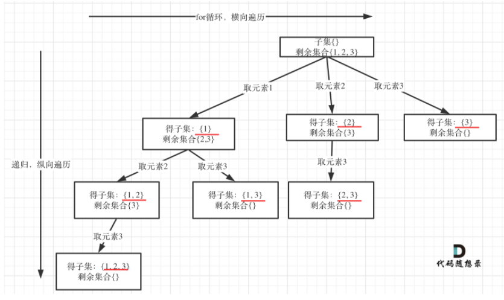

#### [78. 子集](https://leetcode.cn/problems/subsets/)

给你一个整数数组 nums ，数组中的元素 互不相同 。返回该数组所有可能的子集（幂集）。

解集 不能 包含重复的子集。你可以按 任意顺序 返回解集。

 

示例 1：

输入：nums = [1,2,3]
输出：[[],[1],[2],[1,2],[3],[1,3],[2,3],[1,2,3]]
示例 2：

输入：nums = [0]
输出：[[],[0]]


提示：

1 <= nums.length <= 10
-10 <= nums[i] <= 10
nums 中的所有元素 互不相同


**思路：**

子集问题与前面的问题有所不同，可以这样理解，组合问题和分割问题都是收集数的叶子节点，而子集问题是找所有树的节点。

子集问题也是组合问题{1,2}与{2,1}是相同的，因此要考虑去重问题，**既然是无序，取过的元素不会重复取，写回溯算法的时候，for就要从startIndex开始，而不是从0开始！**

反之，求解排列问题的时候，就要从0 开始，因为排列问题中集合是有序的

整体思路如下：



```python
class Solution:
    def subsets(self, nums: List[int]) -> List[List[int]]:
        res=[]
        path=[]
        def backtracking(nums,start_index):
            res.append(path[:])#将第一个空子集放入，这里因为要采集叶子节点，所以位置放到退出条件外面
            if start_index==len(nums):
                return 
            for i in range(start_index,len(nums)):
                path.append(nums[i])
                backtracking(nums,i+1)
                path.pop()
        backtracking(nums,0)
        return res
```

