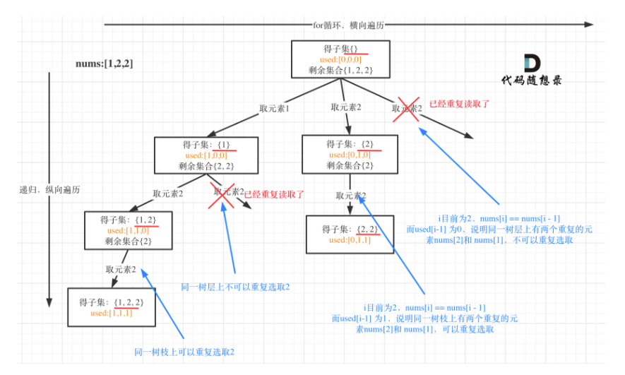

#### [90. 子集 II](https://leetcode.cn/problems/subsets-ii/)

给你一个整数数组 nums ，其中可能包含重复元素，请你返回该数组所有可能的子集（幂集）。

解集 不能 包含重复的子集。返回的解集中，子集可以按 任意顺序 排列。

 

示例 1：

```
输入：nums = [1,2,2]
输出：[[],[1],[1,2],[1,2,2],[2],[2,2]]
```

示例 2：

```
输入：nums = [0]
输出：[[],[0]]
```


提示：

1 <= nums.length <= 10
-10 <= nums[i] <= 10

**思路：这道题与子集区别不大，主要是去重问题，这里通过先排序，再判断是否与前一个元素相同，如果相同，则跳过**

其实就是，递归的时候可以有相同的因为[2]和[2,2]不同，但是for循环中不可以，否则就完全相同了，需要跳过。



```python
class Solution:
    def subsetsWithDup(self, nums: List[int]) -> List[List[int]]:
        res=[]
        path=[]
        nums.sort()
        def backtracking(nums,start_index):
            res.append(path[:])
            if start_index==len(nums):
                return
            for i in range(start_index,len(nums)):
                if i>start_index and nums[i]==nums[i-1]:
                    continue
                path.append(nums[i])
                backtracking(nums,i+1)
                path.pop()
        backtracking(nums,0)
        return res
```

