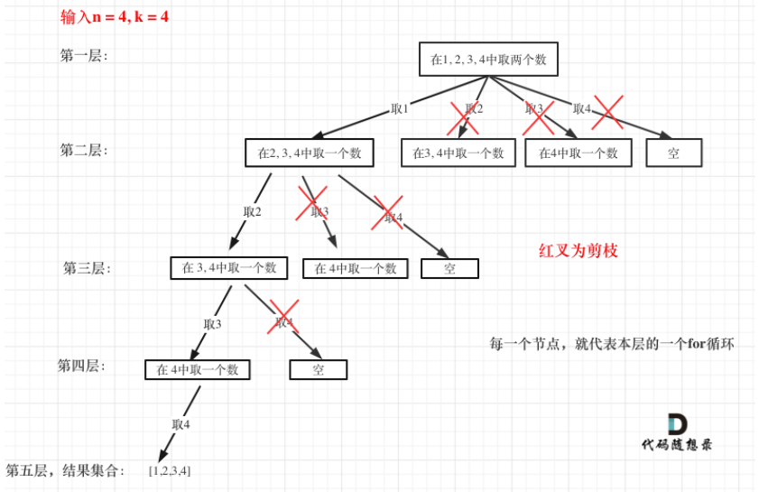

# 回溯基础

主要包含以下


## 回溯法解决的问题

回溯法，一般可以解决如下几种问题：

- 组合问题：N个数里面按一定规则找出k个数的集合
- 切割问题：一个字符串按一定规则有几种切割方式
- 子集问题：一个N个数的集合里有多少符合条件的子集
- 排列问题：N个数按一定规则全排列，有几种排列方式
- 棋盘问题：N皇后，解数独等等

## 理解回溯法

回溯法解决的问题都可以抽象为树形结构，因此，在做题思考的时候，最好画成树形结构，梳理思路，回溯法解决的问题实际上就是在集合中递归查找子集，集合的大小构成了数的宽度，递归的深度，构成了树的深度

同时设计终止条件，限制其为有高度的树

回溯法模版

```java
void backtracking(参数) {
    if (终止条件) {
        存放结果;
        return;
    }

    for (选择：本层集合中元素（树中节点孩子的数量就是集合的大小）) {
        处理节点;
        backtracking(路径，选择列表); // 递归
        回溯，撤销处理结果
    }
}
```

## 剪枝优化

这里以这题为例[77. 组合](https://leetcode.cn/problems/combinations/)

给定两个整数 n 和 k，返回 1 ... n 中所有可能的 k 个数的组合。

示例:
输入: n = 4, k = 2
输出:
[
[2,4],
[3,4],
[2,3],
[1,2],
[1,3],
[1,4],
]



图中的每一个节点，就代表本层的一个for循环，每一层for循环从第二个数开始遍历的话都是没有意义的无效遍历。

**因此可以剪枝的地方就在递归中每一层的for循环所选择的起始位置**

接下来看一下优化过程如下：

1. 已经选择的元素个数：path.size();
2. 还需要的元素个数为: k - path.size();
3. 在集合n中至多要从该起始位置 : n - (k - path.size()) + 1，开始遍历

```java
for (int i = startIndex; i <= n - (k - path.size()) + 1; i++) // i为本次搜索的起始位置
```

